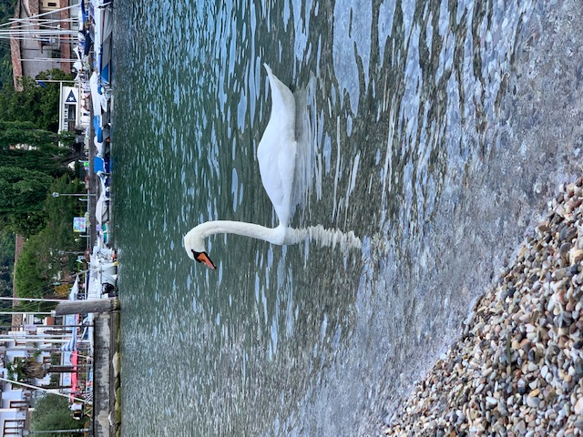

# QUANTITATIVE FINANCE

What I am working on - or what I am curious about\
[QUANTITATIVE FINANCE ](quantfinance.md)

# MATHS

Calculus, Linear Algebra,...\
[MATHS ](math.md)

# OPERATIONS RESEARCH
Papers, Books...\
[OR ](OR.md)

# CLASSICAL MUSIC

Magazines, new albums, concerts,my favorite pianists..\
[CLASSICAL MUSIC](classicalmusic.md)

# DATA SCIENCE and MACHINE LEARNING

My learning hub!\
[DATA SCIENCE](DataScience.md)

# QUANTUM COMPUTING

WooW!\
[QUANTUM COMPUTING](qc.md)
